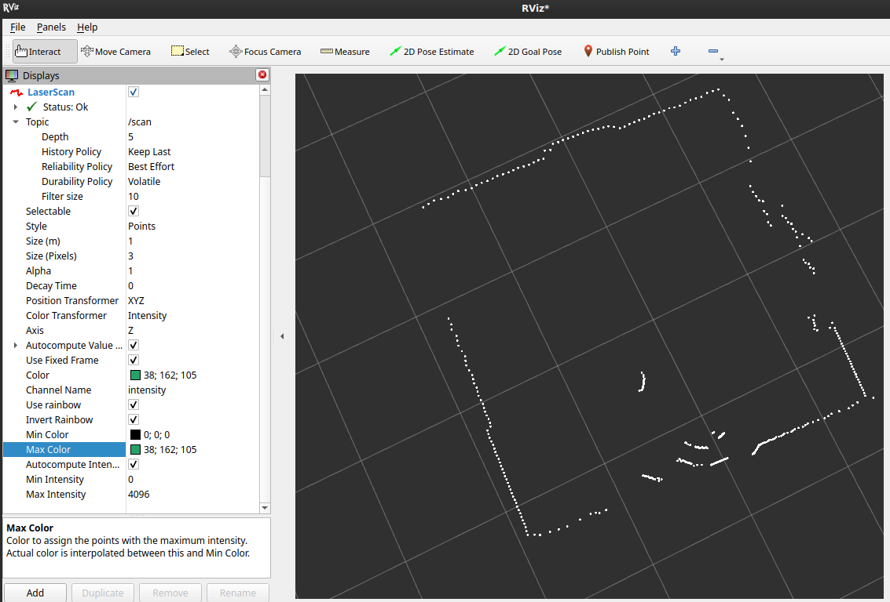

# YDLIDAR X2 Driver & ROS 2 Node

A ROS 2 package for the YDLIDAR X2 2D LiDAR. Includes a pure-Python serial driver and a ROS 2 node.


---


---

## Hardware Setup

The X2 connects via USB–UART adapter. On Linux it typically enumerates as `/dev/ttyUSB0`.

```bash
# Verify the device is visible
ls /dev/ttyUSB*

# Permanent access (log out and back in after)
sudo usermod -aG dialout $USER

# One-shot for testing
sudo chmod 666 /dev/ttyUSB0
```

The X2 starts ranging and streaming automatically on power-up, no start command required.

---

## Build & Install

### Requirements

- ROS 2 (Tested only on Humble)
- Python 3.10

```bash
pip install -r requirements.txt   # pyserial and colcon
```

## Build

```bash
cd <your_ws>
colcon build --packages-select ydlidarpy
source install/setup.bash
```

---

## Usage

### ROS 2 node

```bash
ros2 run ydlidarpy x2_node
```

#### Parameters

| Parameter | Default | Description |
|---|---|---|
| `port` | `/dev/ttyUSB0` | Serial port |
| `baudrate` | `115200` | Fixed, do not change |
| `frame_id` | `laser` | TF frame for scan messages |
| `topic` | `scan` | Published topic name |
| `min_range` | `0.01` m | Minimum valid range |
| `max_range` | `8.0` m | Maximum valid range |

```bash
ros2 run ydlidarpy x2_node --ros-args -p port:=/dev/ttyUSB1 -p max_range:=6.0
```

### Standalone driver (no ROS)

Useful for verifying serial comms before involving ROS:

```bash
cd ydlidarpy/ydlidarpy
python ydlidar_driver.py
# prints:  angle_deg  distance_mm  per point
```

---

## Published Topics

| Topic | Type | QoS |
|---|---|---|
| `/scan` | `sensor_msgs/LaserScan` | BEST_EFFORT / VOLATILE |

### LaserScan details

- **360 bins**, one per degree (`angle_increment = 2π/360`)
- Published **once per packet** (~40 samples), not once per full revolution
- **Persistent buffer**, each bin holds its last valid reading until overwritten; bins never seen will remain `inf`

---

## Protocol Reference

### Packet structure

```
Offset  Field  Size  Description
0       PH     2B    Header: 0xAA 0x55
2       CT     1B    bit0=1: start-of-frame; bits7:1: scan freq (F = CT[7:1] / 10)
3       LSN    1B    Sample count in this packet
4       FSA    2B    Start angle (raw)
6       LSA    2B    End angle (raw)
8       CS     2B    XOR checksum (excludes itself)
10      Si…    2B×N  Distance samples (little-endian)
```

### Decoding

```
Distance_i (mm) = Si / 4

Angle_FSA       = (FSA >> 1) / 64
Angle_LSA       = (LSA >> 1) / 64
Angle_i         = diff(Angle) / (LSN - 1) * i + Angle_FSA   (linear interp)

# Per-point angle correction:
if Distance_i == 0:
    AngCorrect = 0
else:
    AngCorrect = atan(21.8 * (155.3 - Distance_i) / (155.3 * Distance_i))

Angle_i_final = Angle_i + AngCorrect
```

### Checksum

XOR of all 16-bit words **except CS** (bytes 8–9): `PH ^ (CT|LSN) ^ FSA ^ LSA ^ S1 ^ ... ^ SN`

---

## Debugging

### No data / silent device

```bash
# Confirm the device is streaming raw bytes
python -c "
import serial, time
s = serial.Serial('/dev/ttyUSB0', 115200, timeout=1)
time.sleep(0.5)
print(s.read(64).hex())
"
# Expect packets beginning with: 55aa
```

### Persistent checksum failures (`packets_bad_cs` climbing)

- Cable quality, try a different USB cable or port
- Any baud rate other than 115200 will cause this
- Enable debug logging to see exact mismatches:

```bash
python -c "
import logging; logging.basicConfig(level=logging.DEBUG)
from ydlidarpy.ydlidar_driver import YDLidarX2
with YDLidarX2() as lidar:
    for a, d, s in lidar.scan():
        print(f'{a:.1f}deg  {d:.0f}mm')
"
```

### Driver stats

```python
print(lidar.stats)
# {'packets_ok': 1482, 'packets_bad_cs': 1, 'serial_errors': 0}
```

### Check topic publishing frequency
```bash
ros2 topic hz /scan
```

### Scan has gaps / missing sectors

Normal for highly reflective or absorptive surfaces. The persistent buffer retains the last-seen value per bin, if you need to detect fresh-vs-stale readings, timestamp each bin write separately in your consumer.

### Angles look rotated

The X2 has no absolute zero reference. Mounting orientation determines where angle 0 falls. Apply a static TF offset in your URDF or add a yaw rotation to the `map -> laser` transform in `x2_node.py`.

### `spin_scan()` blocks the ROS executor

`spin_scan()` runs a blocking serial loop on the main thread. If you need ROS timers, services, or parameter updates to stay responsive, move it to a thread:

```python
import threading
t = threading.Thread(target=node.spin_scan, daemon=True)
t.start()
rclpy.spin(node)
```

---

## Known Limitations

- `spin_scan()` is blocking, see threading note above
- `scan_time` is hardcoded to `1/7.0 s`; the actual frequency encoded in `CT[7:1]` is not forwarded
- Power-on info packet (`A5 5A 14 00 00 00 04 ...`) is not parsed, the driver syncs past it automatically
- No dynamic reconfigure support

---
